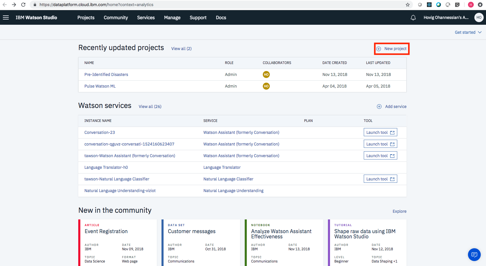
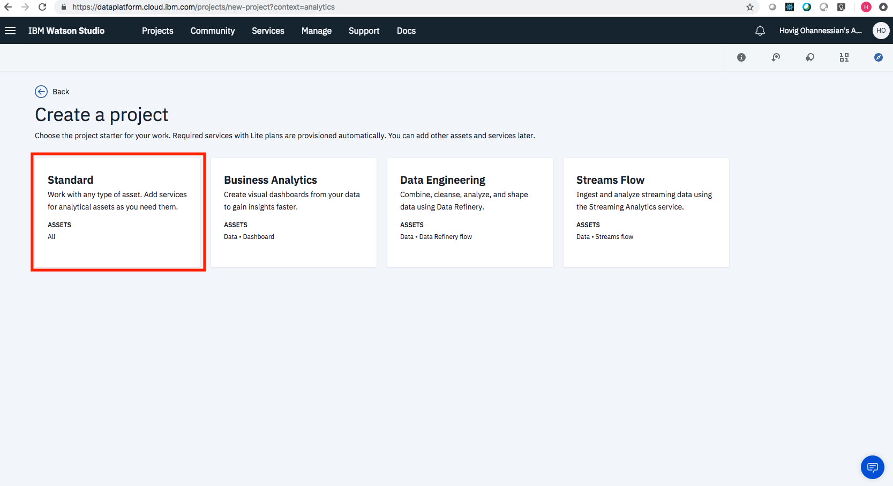
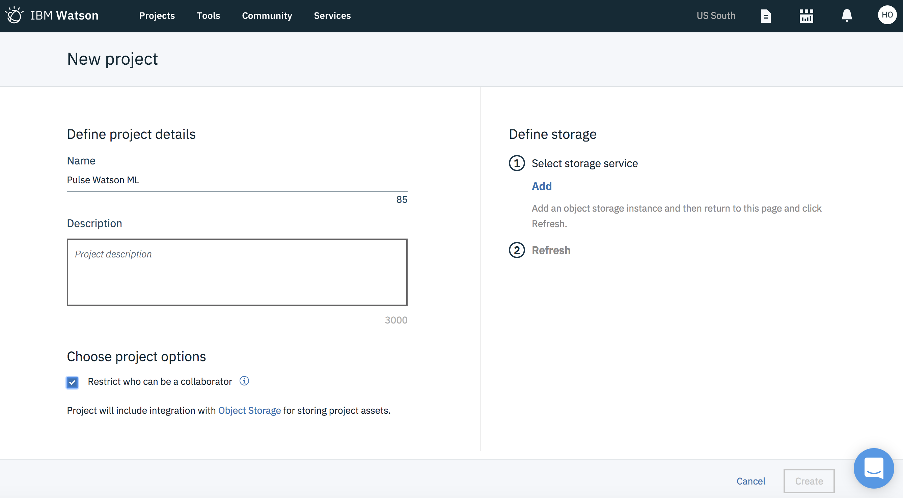
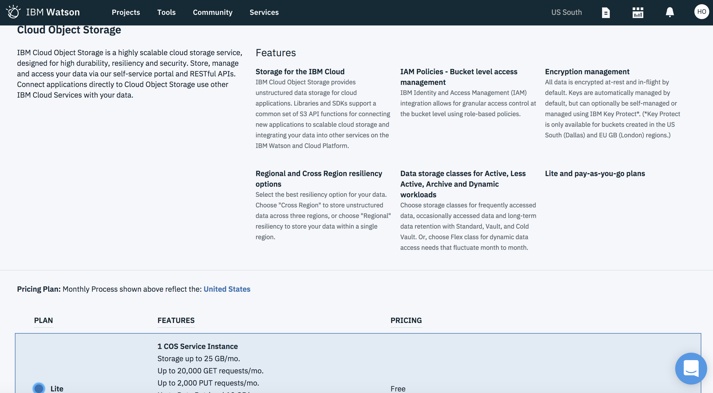
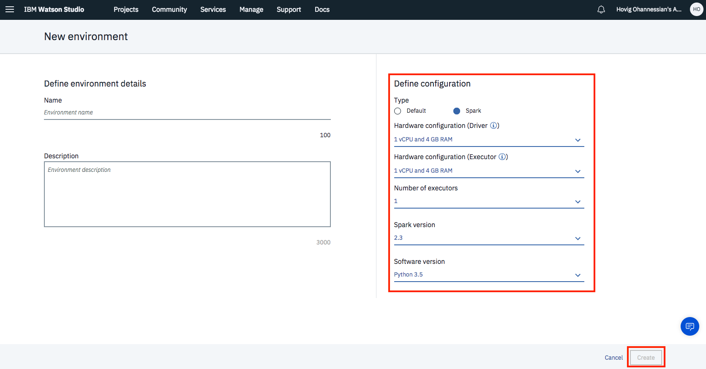
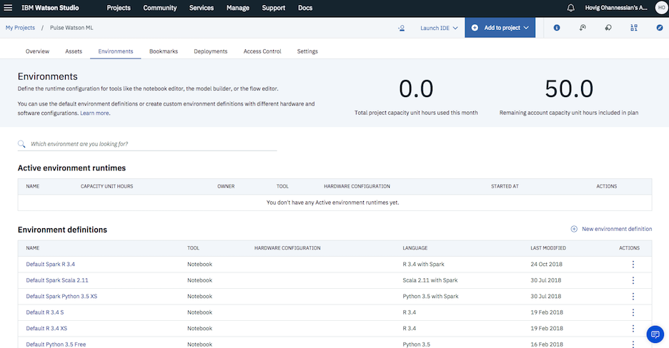
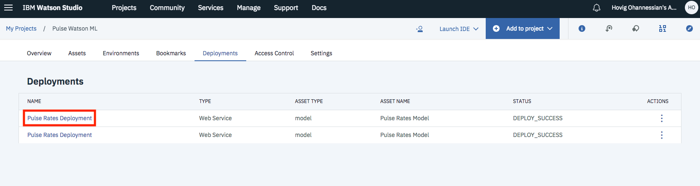
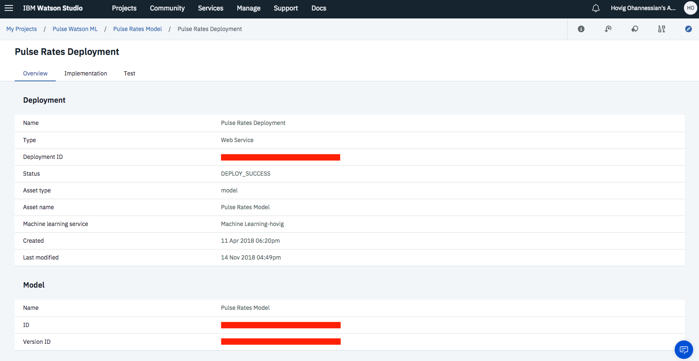
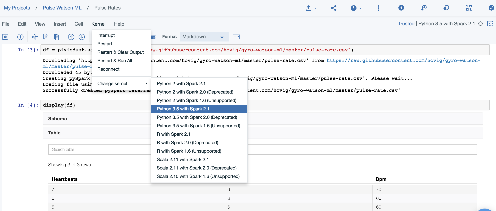
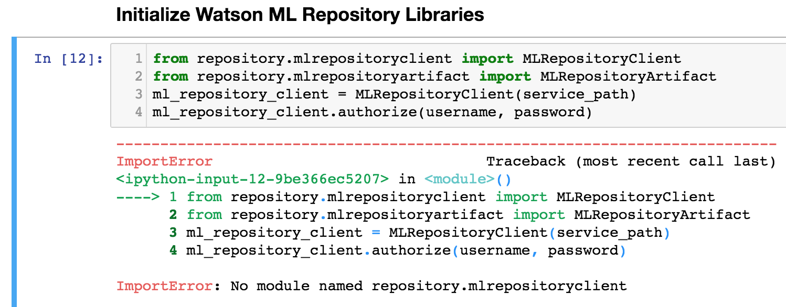

## Data Platform

At IBM Watson Studio is where you can analyze data using Jupyter Notebooks and RStudio in an easy designed environment that includes all IBM needed services and kernels for data analytics.

- __A model setup on [IBM Watson Studios](https://dataplatform.ibm.com) is needed to perform the prediction scoring of the beats per minute (bpm)__
- __Create a new project in there (click on "+ Add a Project" OR on "Create A New Project" from homepage)__

- __Choose Spark to create an instance of it__

> Creating an environment with Spark and Python

> You can always come back and create the needed kernel

> After deploy

- __Make use of [Pulse Rates.ipynb](https://github.com/hovig/gyro-watson-ml/blob/master/Pulse%20Rates.ipynb) as your Jupyter notebook model__
- __Make use of [pulse-rate.csv](https://github.com/hovig/gyro-watson-ml/blob/master/pulse-rate.csv) to feed it into the Spark pipeline in your model__
- __I used for my IBM Watson Studio Jupyter notebook these following Kernel versions: Spark 2.1 and Python 3.5__

> _Important_: __This pattern's notebook is running on IBM Watson Studio and not local. Make sure you have Spark associated as a Kernel for your project. If you want to run it local make sure you have Spark installed and plugged in as a kernel in your local notebook.__

If you get this following error. Make sure you don't have another version of `python` installed on some local path.

