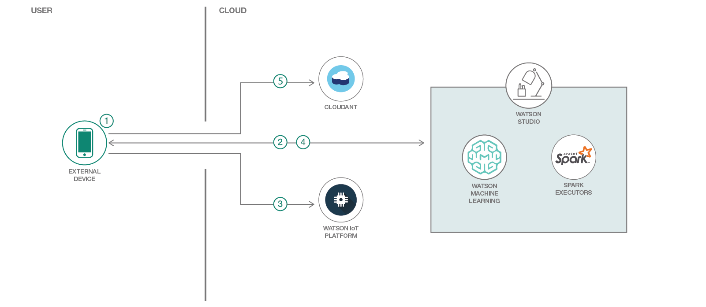

> **DISCLAIMER**: This application is used for demonstrative and illustrative purposes only and does not constitute an offering that has gone through regulatory review. It is not intended to serve as a medical application. There is no representation as to the accuracy of the output of this application and it is presented without warranty.

**__Skill Level__**: Intermediate
**__N.B__**: All services used in this repo are Lite plans. Also, star this repo if you like what you see.

# MyPulse - An IoT Waton Machine Learning Mobile Health App

The idea behind this application is to have a way to check pulse rates with the most available devices, mobile phones. Here's a brief description of the code pattern:

* Create a classification model using a dataset which contains the pulse data and its related derived values. Deploy the model and expose it as Watson Machine Learning endpoints
* Register the mobile device with Watson IoT Platform
* Using the mobile app, generate the LIVE pulse data. This data is published to IoT platform and then stored in a NoSQL database
* Streaming the pulse data from the app in real-time (or the database) and using Watson Machine Learning validate it with the deployed model

## Steps

* Steps 1 & 5 - [Node.js application](https://github.com/hovig/pulse-iot-wml-mobile-health/blob/master/NodejsApplication.md)
* Step 2 - [Watson Machine Learning](https://github.com/hovig/pulse-iot-wml-mobile-health/blob/master/WatsonMachineLearning.md)
* Step 3 - [Watson IoT Platform](https://github.com/hovig/pulse-iot-wml-mobile-health/blob/master/WatsonIoTPlatform.md)
* Step 4 - [IBM Studios](https://github.com/hovig/pulse-iot-wml-mobile-health/blob/master/IBMStudios.md)

## Sample output

* After doing the above steps, try it on your mobile phone's browser: `http://<YOUR_APP_NAME>.mybluemix.net`

  You can try our demo app at [http://mypulse.mybluemix.net/](http://mypulse.mybluemix.net/) to have an idea how it looks. Note that if the machine learning service is over quota is will show `undefined` for some fields.

* Open [Watson IoT Platform Quickstart](https://quickstart.internetofthings.ibmcloud.com/#/)
* Put your device id on there for real-time streaming view of your data.

## Links

* [IBM Cloud](https://bluemix.net/)  
* [IBM Cloud Documentation](https://www.ng.bluemix.net/docs/)  
* [IBM Cloud Developers Community](http://developer.ibm.com/bluemix)  
* [IBM Watson Internet of Things](http://www.ibm.com/internet-of-things/)  
* [IBM Watson IoT Platform](http://www.ibm.com/internet-of-things/iot-solutions/watson-iot-platform/)   
* [IBM Watson IoT Platform Developers Community](https://developer.ibm.com/iotplatform/)
* [Savitzky–Golay filter for smoothing the accelerometer data](https://en.wikipedia.org/wiki/Savitzky%E2%80%93Golay_filter)
* Thanks to Mark Watson for making the "[watson-ml-model-utils](https://www.npmjs.com/package/watson-ml-model-utils)" library
* [Optional: additional use case lookup](https://developer.ibm.com/in/2017/05/31/watson-iot-platform-based-heart-emotion-analysis-using-lyfas-device-apache-spark/)

## License
[Apache 2.0](LICENSE)
