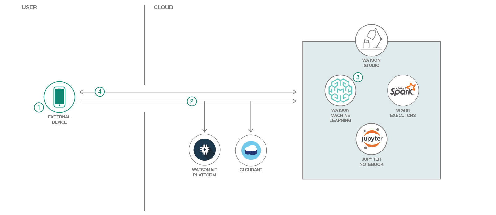
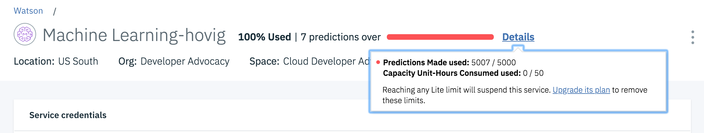
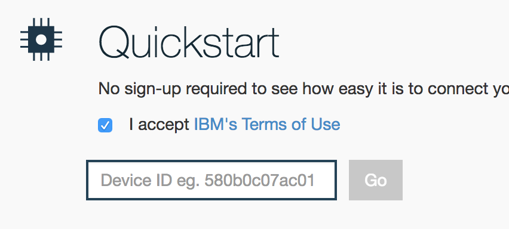
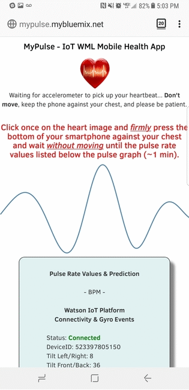

# WARNING: This repository is no longer maintained :warning:

> This repository will not be updated. The repository will be kept available in read-only mode.

*Read this in other languages: [日本語](README-ja.md).*

> **DISCLAIMER**: This application is used for demonstrative and illustrative purposes only and does not constitute an offering that has gone through regulatory review. It is not intended to serve as a medical application. There is no representation as to the accuracy of the output of this application and it is presented without warranty.

**__Skill Level__**: Intermediate
**__N.B__**: All services used in this repo are Lite plans. Also, star this repo if you like what you see.

# MyPulse - An IoT Watson Machine Learning Mobile Health App

The idea behind this application is to have a way to check pulse rates with the most available devices, mobile phones. Here's a brief description of the code pattern:

* Create a classification model using a dataset which contains the pulse data and its related derived values. Deploy the model and expose it as Watson Machine Learning endpoints
* Register the mobile device with Watson IoT Platform
* Using the mobile app, generate the LIVE pulse data. This data is published to IoT platform and then stored in a NoSQL database
* Streaming the pulse data from the app in real-time (or the database) and using Watson Machine Learning validate it with the deployed model

## Steps

* Step 1 - [Node.js application](NodejsApplication.md)
* Step 2 - [Watson IoT Platform Service](WatsonIoTPlatform.md) & [Cloudant Database Service](Cloudant.md)
* Step 3 - [Watson Machine Learning](WatsonMachineLearning.md)
* Step 4 - [IBM Watson Studios](IBMStudios.md)

## See Output Results

* __After doing the above steps, try it on your mobile phone's browser: `http://<YOUR_APP_NAME>.mybluemix.net`__

  __You can try our demo app at [http://mypulse.mybluemix.net/](http://mypulse.mybluemix.net/) to have an idea how it looks. Note that if the machine learning service is over quota is will show `undefined` for some fields.__

* __Open [Watson IoT Platform Quickstart](https://quickstart.internetofthings.ibmcloud.com/#/)__
* __Put your `Device ID` (found on your mobile app) on there for real-time streaming view of your data.__

## Links

* [IBM Watson Studio](https://www.ibm.com/us-en/marketplace/data-science-experience)
* [Introduction to Watson Studio](https://www.youtube.com/watch?v=TiS-LGfNoSo)
* [IBM Cloud](https://bluemix.net/)  
* [IBM Cloud Documentation](https://www.ng.bluemix.net/docs/)  
* [IBM Cloud Developers Community](http://developer.ibm.com/bluemix)  
* [IBM Watson Internet of Things](http://www.ibm.com/internet-of-things/)  
* [IBM Watson IoT Platform](http://www.ibm.com/internet-of-things/iot-solutions/watson-iot-platform/)   
* [IBM Watson IoT Platform Developers Community](https://developer.ibm.com/iotplatform/)
* [Savitzky–Golay filter for smoothing the accelerometer data](https://en.wikipedia.org/wiki/Savitzky%E2%80%93Golay_filter)
* [watson-ml-model-utils](https://www.npmjs.com/package/watson-ml-model-utils)
* [Install & Configure Pixiedust](https://github.com/pixiedust/pixiedust/wiki/Setup:-Install-and-Configure-pixiedust)
* [Optional: additional use case lookup](https://developer.ibm.com/in/2017/05/31/watson-iot-platform-based-heart-emotion-analysis-using-lyfas-device-apache-spark/)

## License
This code pattern is licensed under the Apache Software License, Version 2.  Separate third party code objects invoked within this code pattern are licensed by their respective providers pursuant to their own separate licenses. Contributions are subject to the [Developer Certificate of Origin, Version 1.1 (DCO)](https://developercertificate.org/) and the [Apache Software License, Version 2](http://www.apache.org/licenses/LICENSE-2.0.txt).

[Apache Software License (ASL) FAQ](http://www.apache.org/foundation/license-faq.html#WhatDoesItMEAN)
